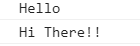
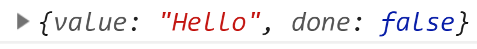
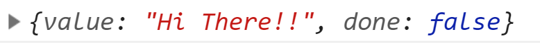
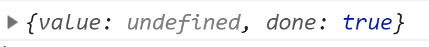
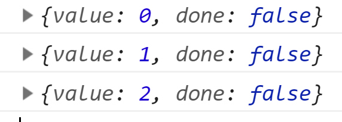
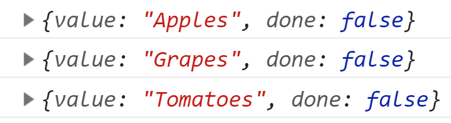
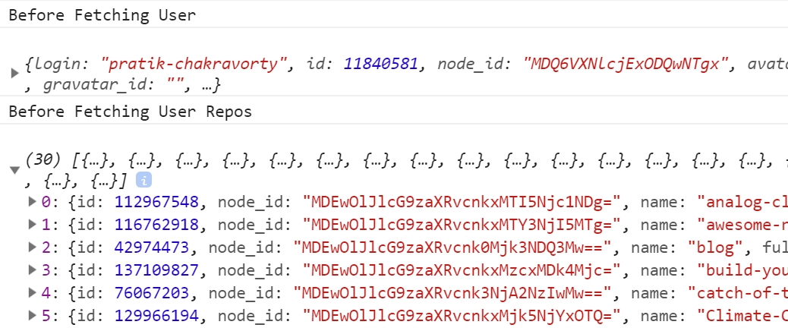

We all know that a function in Javascript runs in a top down fashion. For example in the following code:

```javascript
function sayHello() {
  console.log("Hello");
  console.log("Hi There!!");
}
sayHello();
```

This provides the following output.



Generator functions allow you to pause a function and resume a function. So with this you can suspend a function in between and do something else. Finally resume the functions execution right at the point you suspended. The following code is an example of a generator function:

```javascript
function* sayHello() {
  //this is a generator function
}
```

Notice the `*` right after the function keyword. This asterisk is used to denote a function as a generator function. Now with a generator function you get a special keyword that you can use to suspend from a function and go do something else. This keyword is called `yield`. Remember this keyword will only work when you are inside a generator function. The code for that will look as follows:

```javascript
function* sayHello() {
  yield "Hello";
  yield "Hi There!!";
}
```

Now to use a generator function you can do the following:

```javascript
const sayHelloGen = sayHello();
console.log(sayHelloGen.next());
```

This gives you the following output:

Now in the above code notice the use of the method `next`. This method allows you to output whatever you yield from the generator function. In this case the first thing that we yield from the generator function above is the string "Hello" and so we get that but not exactly as a string but rather as an object with a value property set to "Hello". This object also contains another important property called done which has a boolean value of false. This means that the generator function has not finished in completion and still has more things to return back to which is certainly the case. Now if we write the following code again.

```javascript
console.log(sayHelloGen.next());
```


We get the next thing that we yield which is "Hi There!!". We still see that the value of the done property is set to false. Now if we run the above code again we can see the following:

Interestingly now the value property has been set to undefined as we don't have anything else to yield and the done property is now set to true. Now no matter how many times we execute the above code it will return the same object.

Now in technical lingo what is happening is that the generator function returns something called an iterator and we go through each objects in the iterator through the use of the next method. Now generators are useful as it maintains the state value. To give an example take the following:

```javascript
function* increment() {
  let i = 0;
  yield i;
  i++;
  yield i;
  i++;
  yield i;
  i++;
}

const incrementGen = increment();

console.log(incrementGen.next());
console.log(incrementGen.next());
console.log(incrementGen.next());
```



As you can see that when we call the next method for the first time we get back 0 as the value. Now when we call it again it goes back to the generator function executes the code right after the first yield and then gives us back a value with 1. The same thing happens when we call the next method again. So with generator functions we can maintain the state of some variable even after the function has been suspended.

Now instead of writing these yield statements a bunch of times we can make use of the for of loop and just write it once. For example suppose we have the following code:

```javascript
const items = ["Apples", "Grapes", "Tomatoes"];
function* justLooping() {
  for (item of items) {
    yield item;
  }
}

const loopingGen = justLooping();
console.log(loopingGen.next());
console.log(loopingGen.next());
console.log(loopingGen.next());
```

This gives us the following output in the browser's console:


So the for of loop works with generators as well. We can use it to yield a bunch of things without writing yield every dang time. Now that's all fine and good but you might be wondering why do I even care about all this where will I actually need a generator function.

The importance of generator function comes in cases when you have to do Ajax requests. We all have had the issue of underfetching with API calls. We fetch some data from an API and then we use a specific thing from that data to fetch another thing and then we use something else from there and fetch another. As you can see this waterfall API fetching goes on. By waterfall I mean that besides the first one each successive API requests need the existence of the previous one.

For example lets say we have the following code:

```javascript
function* getStuff() {
  const user = yield ajax("http://api.github.com/users/pratik-chakravorty");

  const repos = yield ajax(
    "http://api.github.com/users/pratik-chakravorty/repos"
  );
}

function ajax(url) {
  fetch(url)
    .then(data => data.json())
    .then(data => getStuffGen.next(data));
}

const getStuffGen = getStuff();
getStuffGen.next();
```

Now I know the above code is not the best example but it drives the point through. Imagine we have two API's that return some data. Now we need the data from the first API to actually make the request for the data of the second API. This could be anything from an ID property to a username.
Now what the above code is doing is that first we have defined our generator function `getStuff` which has two const variables each of them have a yield. Now when we execute `getStuffGen.next()` it basically starts the whole thing. It goes to the generator function finds the first yield and executes the function beside it which is an ajax function. Can't find a reference to this function inside its own scope goes to the outer scope finds the reference and executes the function passing the value of the url. The ajax function contains a call to the fetch API which then gives back the data for the given API.

Now notice the line `getStuffGen.next(data)`. This line uses the next method in a different way. Instead of calling next directly without any arguments it passes the data that we got back from our API call. Now where does this data get stored. Well it gets stored in the user const variable in the `getStuff` function

Effectively what is happening is that until the data from the first yield comes back the second yield in that generator function wont be called at all. This makes the code more readable which is a big thing when we have thousands of such API requests everywhere. So to illustrate my point lets add some console.logs in the above code.

```javascript
function* getStuff() {
  console.log("Before Fetching User");
  const user = yield ajax("http://api.github.com/users/pratik-chakravorty");
  console.log(user);

  console.log("Before Fetching User Repos");
  const repos = yield ajax(
    "http://api.github.com/users/pratik-chakravorty/repos"
  );
  console.log(repos);
}

function ajax(url) {
  fetch(url)
    .then(data => data.json())
    .then(data => getStuffGen.next(data));
}

const getStuffGen = getStuff();
getStuffGen.next();
```

This gives us the following:


So with that I hope this clears the idea behind generator functions. In simple terms its nothing but a function with special play and pause controls. Thats what the feature image of this blog post means. Generator functions are used in the popular Redux library Redux-Saga which is used for writing async actions in Redux hence it is a pretty important concept to understand.

As always thanks for reading this article and I will be back with another one.
