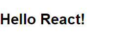
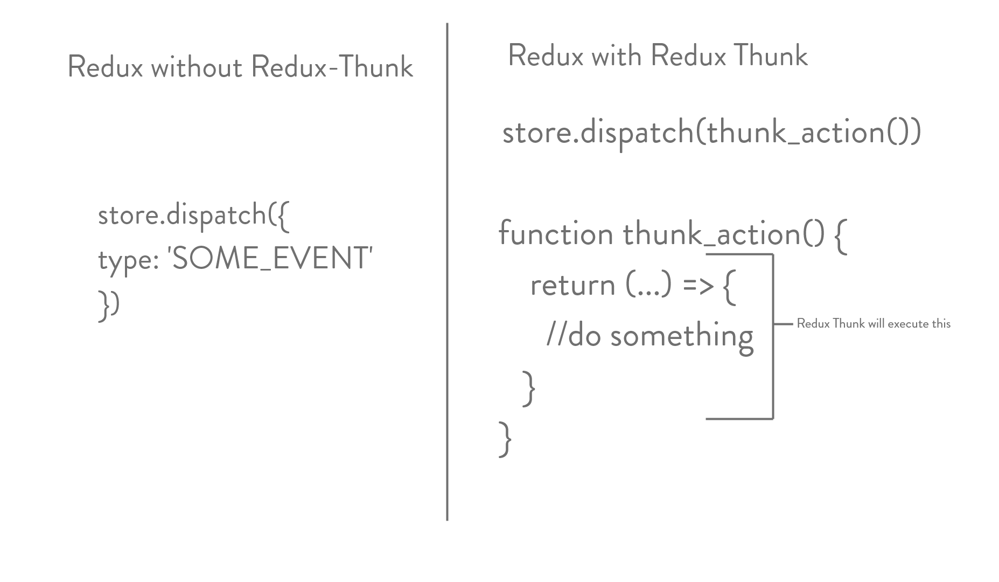
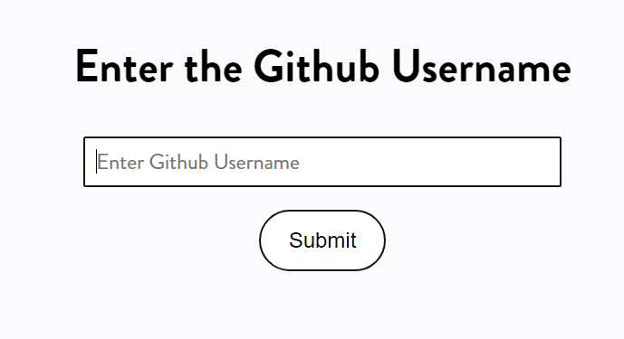
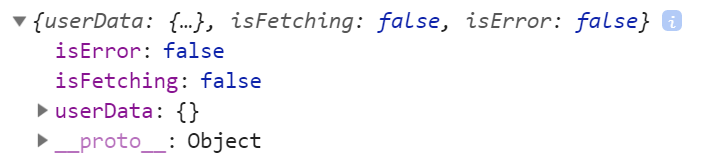
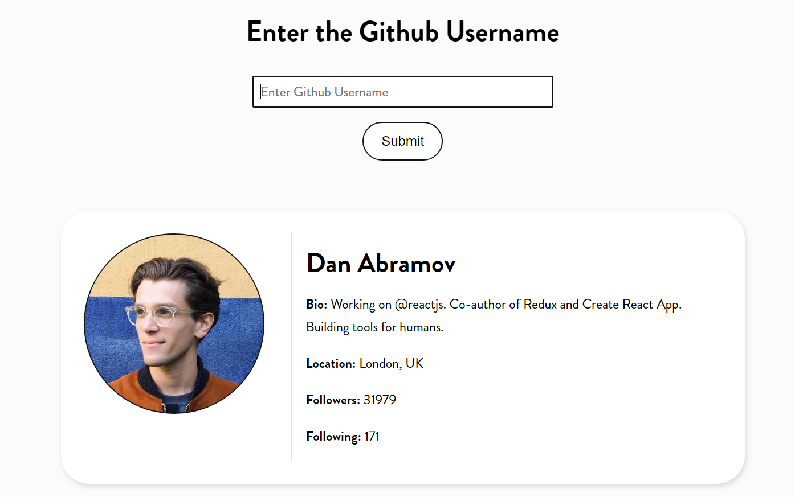

Redux is a state management library that has become increasingly popular but there is a learning curve to it. There are certain technical terms that throws off people when they first start learning
Redux. If you feel like you need to understand Redux a bit more I suggest trying out my [Redux CRUD article](https://codeburst.io/redux-a-crud-example-abb834d763c9). It is a long article that goes over the important concepts of Redux like what are actions,reducers and stores all while building a CRUD based application. In this post which is a follow up to the previous Redux article I will try to explain what is Redux Thunk by building a Github Explorer application.

So let's get started first thing you will need is create-react-app so make sure you have it installed in your system if not type the following command in a terminal:

```
npm install -g create-react-app
```

Why are you using npm? Old habits die hard. Now that you have the tool set up lets create a new project.

Type the following in the terminal

```
create-react-app github-explorer
```

This should create a new project for you with all the dependencies. Let's open this up in a new text editor by changing to this directory using:

```
cd github-explorer
```

I use visual studio code as my text-editor but you can use whatever you are comfortable. Now whenever I start writing any React application first thing I do is a bit of clean up. Call it housekeeping if you might. So go back to the terminal and type the following:

```
cd src

rm App.css App.test.js logo.svg registryServiceWorker.js
```

Once that is done go back to the text-editor and make some changes to the `index.js` file. The changes should be as follows:

```javascript
import React from "react";
import ReactDOM from "react-dom";
import "./index.css";

import App from "./App";

ReactDOM.render(<App />, document.getElementById("root"));
```

Now head to `App.js` and make the following changes:

```javascript
import React, { Component } from "react";

class App extends Component {
  render() {
    return (
      <div>
        <h2>Hello React!</h2>
      </div>
    );
  }
}
export default App;
```

Now go back to the root directory of the project and type the followng

`npm start`

This gives us the following;


Now lets install Redux, Redux-Thunk and React-Redux.

```
npm install redux redux-thunk react-redux
```

Now create a new folder under the src directory and call it `actions`. Next create a file under that folder and name it `fetchAction.js`. Once that is done create another folder under the src directory called `reducers` and create a file under it called `index.js`. Once all that is done under the src directory create a file called `store.js`.

Now lets write some code. Inside `store.js` write the following code:

```javascript
import { createStore, applyMiddleware } from "redux";
import asyncReducer from "./reducers";
import thunk from "redux-thunk";

const store = createStore(asyncReducer, applyMiddleware(thunk));

export default store;
```

We import the `createStore` function and the `applyMiddleware` function. The first one will be used for creating the redux store while the latter will be used for adding the thunk middleware. Next we have an import statement from the reducers directory ignore that for now. Basically it is importing the reducer we will need for this application. Here the name of the reducer is `asyncReducer`. Next we import `thunk` from the `redux-thunk` package.

Finally we create the store using the `createStore` method passing the asyncReducer and the applyMiddleware functions to it.

Now that we have the store lets write the reducer for this application. Go back to `index.js` under the reducers directory. Note go to `index.js` under the reducers folder not the root `index.js` file. In there write the following code:

```javascript
const initialState = {
  userData: {},
  isFetching: false,
  isError: false
};

const asyncReducer = (state = initialState, action) => {
  return state;
};

export default asyncReducer;
```

Here we have a pretty basic reducer. What is interesting here is the shape of the state object. The state contains two properties one is `userData` and the other is `isFetching`. The `userData` is an object that will house all the user related information that we will get from our API. The `isFetching` property will be used to load the loading indicatior depending upon when the API request is made.

Go back to `index.js` and make the following changes:

```javascript
import React from "react";
import ReactDOM from "react-dom";
import "./index.css";

import App from "./App";
import store from "./store";
import { Provider } from "react-redux";

ReactDOM.render(
  <Provider store={store}>
    <App />
  </Provider>,
  document.getElementById("root")
);
```

Here we have imported the `store` that we created earlier inside `store.js`. We are also making use of the `Provider` component that allows us to access the store from our components. Hence we pass the `App` component which is the root component into the provider passing the store as a prop.

Now lets go back to `fetchAction.js` which is inside our actions folder and write the following code.

```javascript
import store from "../store";

export const fetch_post = () => {
  return {
    type: "FETCH_USER"
  };
};

export const receive_post = post => {
  return {
    type: "FETCHED_USER",
    data: post
  };
};

export const receive_error = () => {
  return {
    type: "RECEIVE_ERROR"
  };
};
```

In here we are making use of action creators. Now action creators are just functions that returns an action object. Here we have three action creators each of them returning an action. A little refresher before going forward. Actions are plain old javascript objects which has a mandatory type property. This property defines what sort of action/event is taking place in the application. The first action creator `fetch_post` is responsible for starting the fetch request. It would be used mainly for showing the loading indicator.

The second action creator `receive_post` will be called when we get back the data from github. Finally `receive_error` is a an action creator that will be called only when we have an error in getting our data back from github's servers.

Now you might be wondering what is a thunk or where does a thunk come into play. Well let's discuss it. First lets understand what is a thunk in the most basic sense. A thunk is a function that returns another function. For example:

```javascript
function say() {
  return function something() {
    //code here
  };
}
```

The above function `say()` is a thunk because it returns another function in this case `something()`. Now how is this useful you might ask. Well we know that in Redux reducers are pure functions hence we can't do any async operations inside the reducers and actions are just plain old objects.Now our dispatch method inside the store accepts an action object as its parameter what the redux thunk middleware does is that if say an action creator returns a function instead of an object then it simply executes that returning function.



Now the returning function can accept two parameters. Those are `dispatch` and `getState`. This is great because with `dispatch` we can call other action creators. So now all we do for async operations is to do everything that will be async inside the returning function and then call the relevant action creators when the data comes back passing in the new data that we get from the API. These other action creators will then pass this new data as an action object to the reducer and then the reducer can update the application's state with the new data.

So with that in mind let's modify the code in ``fetchAction.js` as so:

```javascript
import store from "../store";

export const fetch_post = () => {
  return {
    type: "FETCH_USER"
  };
};

export const receive_post = post => {
  return {
    type: "FETCHED_USER",
    data: post
  };
};

export const receive_error = () => {
  console.log("called");
  return {
    type: "RECEIVE_ERROR"
  };
};

export const thunk_action_creator = username => {
  const user = username.replace(/\s/g, "");
  store.dispatch(fetch_post());
  return function(dispatch, getState) {
    return fetch(`https://api.github.com/users/${user}`)
      .then(data => data.json())
      .then(data => {
        if (data.message === "Not Found") {
          throw new Error("No such user found!!");
        } else dispatch(receive_post(data));
      })
      .catch(err => dispatch(receive_error()));
  };
};
```

So now we have a new function at the bottom called `thunk_action_creator`. This function takes a username as its parameter. First we take the username and sanitize the data meaning removing whitespaces and then put it in the variable user. After that we have our first use of dispatch where we call the `fetch_post` action creator which will be used for setting our loading indicator as previously stated. Next we return a function from the `thunk_action_creator`. This function has access to dispatch and the getState methods of the store object. Here we return something from the fetch call. In the parameter we pass in the url that will be used for fetching users and pass along the username that will be provided by the user. Finally when the data comes back we call another action creator using dispatch which is `receive_post` which takes in the newly received `data` from the API and passes it as an argument. Finally if the data that is returned has a message property with a value of `Not Found` we simply throw a new error stating that the user with such username does not exist and so we catch this error and make a call to `receive_error` which will be used for setting our error flag.

With that in place lets go back to the reducer function and add some more code.

```javascript
const initialState = {
  userData: {},
  isFetching: false,
  isError: false
};

const asyncReducer = (state = initialState, action) => {
  switch (action.type) {
    case "FETCH_USER":
      return Object.assign({}, state, {
        isFetching: true,
        userData: {},
        isError: false
      });
    case "FETCHED_USER":
      return Object.assign({}, state, {
        userData: action.data,
        isFetching: false,
        isError: false
      });
    case "RECEIVE_ERROR":
      return Object.assign({}, state, {
        isError: true,
        isFetching: false
      });
    default:
      return state;
  }
};

export default asyncReducer;
```

We have three switch cases. The first one `FETCH_USER` is used for setting the loading indicator. The next one `FETCHED_USER` is used for setting the data that came from the API in the `userData` object. Finally we have `RECEIVE_ERROR` which sets the error flag to true.
Here is a link to [Object Assign](https://developer.mozilla.org/en-US/docs/Web/JavaScript/Reference/Global_Objects/Object/assign) if you feel like you need a refresher.

Now lets head back to `App.js` and start building the user interface and hook all this up.

```javascript
import React, { Component } from "react";

class App extends Component {
  handleSubmit = e => {
    e.preventDefault();
    const username = this.getUsername.value;
    console.log(username);
  };
  render() {
    return (
      <div className="container">
        <form onSubmit={this.handleSubmit} className="form">
          <h2 className="title">Enter the Github Username</h2>
          <input
            type="text"
            placeholder="Enter Github Username"
            required
            ref={input => (this.getUsername = input)}
          />
          <button className="button">Submit</button>
        </form>
      </div>
    );
  }
}

export default App;
```

I have already prepared the styles for this which are as follows:

```css
body {
  margin: 0;
  padding: 0;
  font-family: sans-serif;
  background: #fbfafc;
  font-family: "Brandon Grotesque";
}

.container {
  max-width: 960px;
  margin: 0 auto;
}
input {
  border: 1.2px solid #141414;
  background: #fff;
  width: 50%;
  font-size: 1.2rem;
  padding: 10px;
  outline: none;
  border-radius: 2px;
}

::placeholder {
  font-size: 1.2rem;
  font-family: "Brandon Grotesque";
}

.form {
  display: flex;
  justify-content: center;
  align-items: center;
  flex-direction: column;
  padding: 10px 20px;
  margin: 60px;
}

.user-info {
  display: grid;
  grid-template-columns: 1fr 2fr;
  grid-gap: 20px;
  background: #fff;
  padding: 2rem;
  border-radius: 40px;
  font-size: 1.2rem;
  box-shadow: 2px 4px 10px rgba(0, 0, 0, 0.12);
  margin-bottom: 40px;
}
.content {
  line-height: 2rem;
}

.error {
  color: #ff5a5f;
  text-align: center;
  font-size: 2rem;
}

.avatar {
  border-right: 1px solid rgba(0, 0, 0, 0.12);
  display: flex;
  align-items: flex-start;
}

.title {
  font-size: 2.5rem;
}

.button {
  background: #fff;
  border: 1.2px solid #141414;
  padding: 15px 25px;
  border-radius: 40px;
  text-align: center;
  margin-top: 20px;
  font-size: 1.2rem;
  transition: all 0.2s ease-in-out;
  outline: none;
}

.button:hover {
  background: #141414;
  color: #fff;
}
img {
  border-radius: 50%;
  border: 2px solid #141414;
}
```

Put all that code inside `index.css`. Note that I am using a custom font here so you might have to try something else.Now with all that if we go back and check the browser it should look like this:



Now if we type something in the input and hit submit we can see that we are able to capture the user data inside the console as well.

Now I know I could have made the form a controlled component and used an `onChange` handler. I used `refs` as they are simpler to understand atleast for me. You can switch back to using your preferred way.

Now lets head back to `App.js` and connect it to our store.

```javascript
import React, { Component } from "react";
import { connect } from "react-redux";

class App extends Component {
  handleSubmit = e => {
    e.preventDefault();
    const username = this.getUsername.value;
    console.log(username);
  };
  render() {
    console.log(this.props.data);
    return (
      <div className="container">
        <form onSubmit={this.handleSubmit} className="form">
          <h2 className="title">Enter the Github Username</h2>
          <input
            type="text"
            placeholder="Enter Github Username"
            required
            ref={input => (this.getUsername = input)}
          />
          <button className="button">Submit</button>
        </form>
      </div>
    );
  }
}

const mapStateToProps = state => {
  return {
    data: state
  };
};
export default connect(mapStateToProps)(App);
```

If we check the console we can see that we have gained access to our store from within the `App` component.



If the above code feels weird to you I strongly suggest checking out my Redux article where I go in depth about `connect` and how the above code basically works.

Now that we have access to the store lets dispatch some action

```javascript
import React, { Component } from "react";
import { connect } from "react-redux";
import UserInfo from "./UserInfo";
import { thunk_action_creator } from "./actions/fetchAction";

class App extends Component {
  handleSubmit = e => {
    e.preventDefault();
    const username = this.getUsername.value;
    this.props.dispatch(thunk_action_creator(username));
    this.getUsername.value = "";
  };
  render() {
    console.log(this.props.data);
    return (
      <div className="container">
        <form onSubmit={this.handleSubmit} className="form">
          <h2 className="title">Enter the Github Username</h2>
          <input
            type="text"
            placeholder="Enter Github Username"
            required
            ref={input => (this.getUsername = input)}
          />
          <button className="button">Submit</button>
        </form>
        {this.props.data.isFetching ? <h3>Loading...</h3> : null}
        {this.props.data.isError ? (
          <h3 className="error">No such User exists.</h3>
        ) : null}
        {Object.keys(this.props.data.userData).length > 0 ? (
          <UserInfo user={this.props.data.userData} />
        ) : null}
      </div>
    );
  }
}

const mapStateToProps = state => {
  return {
    data: state
  };
};
export default connect(mapStateToProps)(App);
```

A lot going on here it seems well not exactly. First we make use of our `thunk_action_creator` inside our `handleSubmit` where we dispatch it passing in the username that we got back from the user.

Inside the App component after the form element we check to see if the isFetching flag from our state is set to true if yes we show the loading indicator. Next we check to see if there are any errors while fetching the data if yes we show the error message. Finally we check to see whether the userData object is empty or not. If not we render the `<UserInfo>` component and pass in the userData object as a `user` prop.

Inside the `UserInfo` component we have the following code:

```javascript
import React, { Component } from "react";

class UserInfo extends Component {
  render() {
    return (
      <div className="user-info">
        <div className="avatar">
          
        </div>
        <div className="content">
          <h1>{this.props.user.name}</h1>
          <p>
            <strong>Bio: </strong>
            {this.props.user.bio}
          </p>
          <p>
            <strong>Location:</strong> {this.props.user.location}
          </p>
          <p>
            <strong>Followers:</strong> {this.props.user.followers}
          </p>
          <p>
            <strong>Following:</strong> {this.props.user.following}
          </p>
        </div>
      </div>
    );
  }
}

export default UserInfo;
```

Just a basic component that takes in the `userData` object and shows it on screen. Now if we go back to the browser and type a username back we see the following:



Now I know all of this is overkill to create such a basic application. We could have done it with React itself. Yes, I agree but my main objective here was to show you how redux thunk works with a simpler example. Once you understand this you can easily take this approach and replicate it in bigger projects with some modifications.

Now that you have an understanding of Redux Thunk improve this application even further use `React Router` and create a separate page use some other API's like Reddit's API and fetch some data and show it in a nice clean user interface. Maybe learn how you can cache these requests. As you can see we can easily expand this application to more complex territories if we desire.

Thanks for reading this long article and I will be back with another one.
